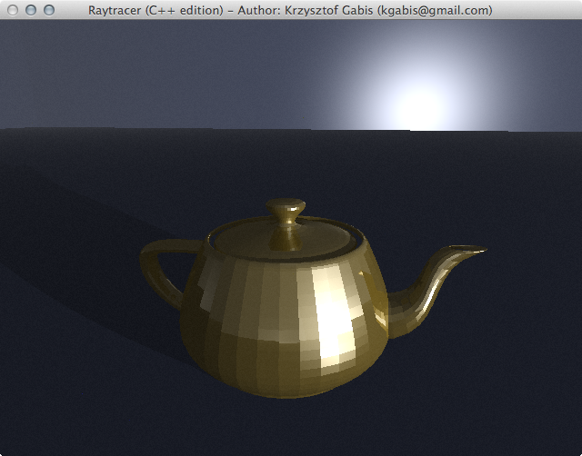

##About
Raytracer in c++. Unfinished, unpolished and messy but nevertheless here it is.

##Controls:
WASDQE, arrows - camera controls  
IJKLUO - light controls  
T/Y - Volumetric shadows on/off  
F/G - Random rendering tresh +/-  

##Dependencies
[GLM](http://glm.g-truc.net/0.9.5/index.html)

##Screens

##License
[The MIT License (MIT)](http://opensource.org/licenses/mit-license.php)